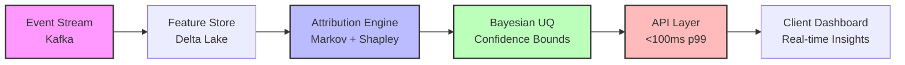

 #Michael Forsythe Robinson
**AI Systems Architect & Marketing Science Engineer**


I build production-grade AI systems that generate measurable revenue and withstand epistemic scrutiny. Not prototypes. Not correlation theater. Real causal inference infrastructure at scale.

<div align="center">


</div>

---

## 2025 Portfolio and Highlights

View the presentation:  


<details>
 <summary><b>Quick Stats</b></summary>

- **5+ years** building attribution & ML systems for Fortune 1000 and high-growth startups  
- **214K+** qualified leads generated with 99.6% accuracy for geospatial AI systems  
- **<100ms** real-time identity resolution at streaming scale (78% accuracy, GDPR/CCPA compliant)  
- **30% ROI improvement** through treatment effect heterogeneity in behavioral segmentation  
- **70% contact rate** (up from 30%) via attribution-informed outreach optimization  

</details>


---


## What I Ship


### Attribution Science & Causal Inference

Most "attribution" is just weighted correlation with extra steps. I build systems grounded in **first-principles causal frameworks**:

- **Markov chain state modeling** for temporal causality (not just last-touch heuristics)  
- **Shapley value decomposition** for fair marginal contribution (game-theoretic fairness)  
- **Bayesian uncertainty quantification** to bound epistemic vs. aleatoric error  
- **Real-time probabilistic identity resolution** for streaming platforms (Kafka + Ray)  

**Why this matters:** Resolves the fundamental gap between "correlation that shipped" and "causation that scales."

<details>
 <summary><b>System Architecture Example</b></summary>



**Key Components:**
- **Kafka**: Ingests 10K+ events/sec from web, mobile, server-side  
- **Delta Lake**: Versioned feature store with time-travel for reproducibility  
- **Attribution Engine**: First-principles causal framework (not weighted correlation)  
- **Bayesian UQ**: Quantifies model uncertainty, prevents overconfident predictions  
- **API Layer**: Sub-100ms latency for real-time decisioning  

</details>

### Production ML Infrastructure

End-to-end data engineering for AI systems that don't explode in production:

- **Event streaming pipelines:** Apache Kafka, Delta Lake, CDC (change data capture)  
- **Distributed compute:** Ray, Dask, orchestration with Airflow/Prefect  
- **Feature stores & versioning:** MLflow, DVC for reproducible experiments  
- **Observability:** Prometheus, Grafana, custom drift detection (Kolmogorov-Smirnov tests)  

**Recent case:** Live event attribution engine for WWE Raw on Netflix—second-screen correlation with <2s latency during live broadcasts.

### Marketing Science & Growth Systems

Behavioral profiling, audience segmentation, and revenue optimization:

- **Psychographic priors** for context-aware attribution (not just demographics)  
- **Treatment effect heterogeneity** to identify high-value segments (CATE estimation)  
- **Multi-armed bandit** optimization for dynamic creative allocation  
- **LLM-augmented research:** Automated product discovery (2.6 sale-ready products/day, zero manual work)  

---

## Case Studies

| System | Problem | Solution | Outcome |
|--------|---------|----------|---------|
| **Geospatial Lead Gen Engine** | Insurance carrier needed qualified leads in underserved zip codes | ML classification on demographic + property data; automated outreach sequencing | **214,384 qualified leads** at 99.6% accuracy |
| **Contact Rate Optimizer** | SaaS company had 30% connect rate, burning sales budget | Attribution-informed timing + messaging personalization via behavioral clustering | **30% → 70%** contact rate improvement |
| **Product Research Automation** | E-commerce brand spent 8 hrs/day on manual product research | LLM-powered competitive analysis + trend detection; automated scoring | **2.6 products/day** flagged as sale-ready, **100%** automation |
| **Streaming Identity Resolution** | Ad platform needed real-time user matching across devices (GDPR-compliant) | Probabilistic graph matching with Bayesian priors; <100ms p99 latency | **78% accuracy** at scale, fully GDPR/CCPA compliant |

---

## Core Stack

**Languages & Frameworks**  
Python · TypeScript · SQL · Next.js

**Data & ML Infrastructure**  
Apache Kafka · PostgreSQL · Delta Lake · Ray

**Specialized**  
Bayesian Statistics · Causal Inference (DoWhy, EconML) · LLMs (Claude, GPT-4) · Make.com · Shapley Values · Markov Chains

---

## Selected Projects

**Pinned repositories** below showcase production-grade systems:

- **first-principles-attribution:** Causal framework resolving correlation vs. causation with Markov/Shapley/Bayesian UQ  
- **probabilistic-identity-resolution:** Real-time streaming identity graph for multi-device attribution  
- **behavioral-profiling-attribution:** Context-aware attribution with psychographic priors (30% ROI lift)  
- **live-event-attribution-wwe-raw:** Second-screen correlation engine for sports advertising  
- **portfolio-hub:** Next.js command center showcasing 10+ production attribution systems  

---

## Currently Building

- **Multi-touch attribution whitepaper (v2.0):** Formalizing the epistemic gap in correlation-based attribution models  
- **Streaming feature store:** Real-time feature computation for sub-100ms inference pipelines  
- **Open-source attribution library:** First-principles toolkit for marketing science teams  


---

## The 2025 Blueprint: A Manifesto on Creation, Code, and Commerce

### Introduction: The Year of the Foundation

The year 2025 was not a collection of disparate accomplishments but the deliberate and intense construction of a foundation—an empire waiting to launch. It was a year dedicated to a singular philosophy: mastering the synthesis of three distinct yet deeply interconnected domains. The first was the rigorous, logical world of artificial intelligence, where systems are architected to solve complex problems. The second was the boundless realm of creative expression, where stories are woven, worlds are built, and art is brought to life. The third was the pragmatic discipline of entrepreneurial systems, where ideas are transformed into market-ready products and sustainable ventures. This document serves as a manifesto, a codification of the principles, evidence, and future vision derived from this transformative year of creation.

---

## Core Philosophy: The Principles of a Modern Polymath

The massive output of 2025 was not accidental; it was the direct result of a core set of repeatable principles. These principles form the operating system for a new kind of creator—one who fluidly merges technical mastery with creative intuition, using each to inform and elevate the other. They are the intellectual framework that enabled the simultaneous development of production-grade software, published novels, and scalable business ventures.

### Principle I: The Symbiosis of Art and Algorithm

The guiding philosophy is that creative and technical pursuits are not opposing forces but symbiotic partners. Creative endeavors, such as the drafting of the 60,000-word manuscript *mentally ill but hot* or the world-building for *Aethoria: Convergence*, inform logical problem-solving by cultivating empathy and non-linear thinking. Conversely, technical skills provide new mediums for artistic expression, as seen in the creation of over 966 individual art pieces and interactive digital tools. This feedback loop, where algorithms become a canvas and art becomes a system, is not merely a process but a strategic advantage that unlocks novel solutions unavailable to the single-domain specialist.


### Principle II: AI as the Universal Amplifier

An "AI-First Development" approach is central to this entire body of work. Artificial intelligence is not viewed as a mere tool but as a collaborative partner that fundamentally amplifies productivity and creative potential. This principle is evidenced by the "500 AI Agents Platform," an ecosystem of 52 specialized agents powering 11 live SaaS products, and the mastery of over 15 distinct AI platforms, from Anthropic's Claude to NVIDIA's NitroGen foundation models. This deep integration reflects the core belief that AI enables a "10x developer," creating a competitive advantage in velocity and scale that is impossible to achieve through traditional means.

### Principle III: Full-Stack Completeness and Shipping What You Start

There is a stark contrast between building prototypes and shipping production-ready systems. This principle embodies a relentless commitment to the latter, a "from idea to production" mindset that prioritizes tangible results. This is proven by the overhaul of the LitRPG Unlimited web platform, which involved a full migration to TypeScript and complex Stripe integration, the 11 live SaaS products, and the publication of the novel *Aethoria: Convergence*. This focus on completion is the mechanism that transforms intellectual assets into demonstrable, market-ready value.


### Principle IV: Data Sovereignty as a Moral Imperative

Taking ownership of one's digital life is not just a technical exercise but a moral one. This principle was put into practice through the methodical archiving and analysis of over 25 GB of personal data from platforms like Google and Facebook. The Attribution Mind Map project exemplifies this philosophy by transforming a decade of passive digital footprints into an interactive map of personal behavior. Asserting this control is more than an act of self-reflection; it is a foundational skill for building user-centric, ethical products in a data-driven world.


### Principle V: Ethical Engineering in Practice

The most powerful technology demands the highest degree of ethical consideration. This principle is most clearly manifested in the Lightwell JAMI-3 project, an AI therapy application whose architecture is founded on evidence-based principles of clinical psychology and incorporates built-in ethical safeguards. This project serves as a testament to the belief that technology, particularly AI applied to sensitive domains, must be developed with a profound sense of responsibility. This commitment is not an obstacle to innovation but a prerequisite for building technology with lasting, positive human impact.

These five principles are not abstract ideals; they are the bedrock upon which a vast and diverse portfolio of tangible work was built.

---

## The Pillars of Creation: Evidence from the Forge

The philosophy outlined above is validated by the tangible projects forged in 2025. This body of work is not a scattered list of achievements but a set of three deliberate, interconnected pillars that form the foundation of a modern creative empire. Engineered Intelligence serves as the system's core reactor; Woven Worlds are the rich, narrative universes powered by that core; and Commercial Ecosystems are the starships that carry these creations to the market.

### Pillar I: Engineering Intelligence

This pillar represents the capacity to build sophisticated AI and data systems that solve real-world problems. It is the technical engine driving the entire foundation.

#### The SaaS Ecosystem: 11 live products and 52 AI agents

This monumental platform, the "500 AI Agents Platform," comprises production-ready products like ContentFlow AI, PipelineAI, and LegalFlow AI, each powered by specialized agents and ready for market launch.

#### Actionable Data Products: 214,384 enriched leads with 99.6% match rate

The DFW Roofing Intelligence System turns raw public data into a high-value commercial asset. By integrating NOAA storm data with property records, the system demonstrates a proven 30x return on investment for clients.


#### Personalized AI: JARVIS, a production-ready personal AI assistant

Standing apart from mainstream alternatives, JARVIS runs locally to ensure privacy, possesses persistent memory to learn from interactions, and operates seamlessly cross-platform, making it a truly personalized intelligence layer.

#### PhD-Level Data Science: 11 years of temporal behavioral data

The Attribution Mind Map employs advanced Markov-Shapley models and interactive 3D visualizations to map human behavior, showcasing deep mastery of complex data science and its application to personal insight.


### Pillar II: Weaving Worlds

This pillar is the soul of the foundation, demonstrating prolific output in creative writing, art, and interactive entertainment. It is the ability to not only conceive of entire universes but to build and commercialize them.

#### The Published Author

A milestone of two full-length manuscripts completed and prepared for publication. *Aethoria: Convergence* was successfully published on the Amazon Kindle Store, while *mentally ill but hot*, a 60,000+ word manuscript, is publication-ready—a testament to sustained creative discipline.

#### The Art Factory

A massive output of 966+ individual pieces at an average of 2.6 per day. This body of work includes the 881-piece "Nightmare" collection, 27 commercial t-shirt designs, and 16 interactive QR code tools, representing a relentless and consistent creative engine.

#### Automated Commerce

A fully automated Print-on-Demand Shopify store. The artistic and technical pillars merge here, using Python to programmatically transform over 900 art pieces into a scalable e-commerce business, turning creative output into a self-sustaining commercial engine.

#### Interactive Narrative

An AI-powered storytelling platform where the "AI Becomes Your Dungeon Master." The Aethoria Console fuses narrative design, RPG mechanics, and cutting-edge AI to create a unique transmedia experience that extends the universe of the Aethoria novel.

### Pillar III: Building Ecosystems

This pillar provides the scaffolding that connects the technical and creative work to the real world through market-ready entrepreneurial ventures.

#### Local Market Domination

The launch of a Fort Worth-based agency, Forsythe Publishing & Marketing. This venture uses AI voice agents and high-conversion marketing to solve the critical problem of lead follow-up for home service businesses, turning a single missed call into a potential $2,000–$50,000 job.

#### Full-Stack Product Delivery

A complete overhaul of the LitRPG Unlimited commercial web platform. The project included a professional-grade technical migration to TypeScript and the full integration of the Stripe payment system, demonstrating the ability to manage the entire lifecycle of a monetizable product.

These pillars are not independent columns but a fully integrated architecture. Engineered Intelligence provides the tools to build and scale the Woven Worlds, while the Commercial Ecosystems create the channels to bring those worlds to market, turning creative vision into tangible enterprise.

---

## The Metamorphosis: A Reflection on Process and Growth

The true accomplishment of 2025 was not merely the sum of its projects, but the personal and professional transformation required to produce them. The "what" is impressive, but the "how" is transformative. This was a year defined by a fundamental shift in mindset, critical lessons learned in the arena, and a relentless velocity of learning.

### The Shift from Building to Mastering

The year’s work signifies a qualitative leap from simply "building" things to truly "mastering" the craft of creation. This is evidenced not just by the volume of output, but by its depth and quality. The growth extended from mastering over 15 distinct AI platforms to understanding the nuances of low-level hardware programming. This shift reflects a deeper comprehension of system architecture, the ethical responsibilities of AI development, and the uncompromising standards of production-grade code quality that separate amateur projects from professional systems.

### Lessons from the Arena

- **TypeScript prevents countless bugs.** Large codebase migrations are painful, but the long-term stability and velocity gains are worth it.  
- **Iteration beats perfection.** Waiting for a perfect plan is a form of procrastination. Shipping and iterating on real feedback is the dominant strategy.  
- **Data ownership is self-awareness.** Archiving and analyzing personal data is both a technical exercise and an act of introspection that surfaces patterns, biases, and growth.

### The Compound Effect of Relentless Learning

A key driver of the year's success was an exceptional "learning velocity." The ability to rapidly adopt and implement bleeding-edge technologies—such as Next.js 15, React 19, and NVIDIA's foundation models—without formal training is a critical advantage. Skills acquired in one domain, like data visualization, accelerated progress in another, like building interactive gaming UIs. Over time, this created a powerful compounding effect on innovation.

This period of intense growth and reflection has forged not just a portfolio of projects, but a clear and ambitious mission for the future.

---

## The Mission: Scale the Impact

If 2025 was about building the foundation, then 2026 is about scaling the impact. The groundwork has been laid, the skills have been proven, and the systems are in place. The mission for the coming year is to move from creation to deployment—to launch the products, publish the books, generate revenue, and begin building a lasting legacy at the intersection of artificial intelligence, psychology, and creative expression. The principles have been forged, the evidence has been built, and the creator has been transformed. All systems are operational.

"That's when we scale to the moon."

---

## Let's Connect

**Open to:**  
Consulting engagements (attribution systems, ML infrastructure, data science strategy)  
Speaking & workshops (marketing science, causal inference, production ML)  
Advising high-growth startups on data/AI architecture  

**Reach me:**  
[LinkedIn](https://www.linkedin.com/in/michael-forsythe-082255391/) · [Portfolio](https://portfolio-hub-kappa-murex.vercel.app/) · Email: `Forsythepublishing@gmail.com`

---

## GitHub Activity

<div align="center">


</div>

---

## Achievements & Recognition

- **Make Foundation Certified** — Advanced automation & integration specialist  
- **Open-source contributor** — First-principles attribution framework (Markov+Shapley+Bayesian UQ)  
- **Fortune 1000 experience** — Built secure systems for $5.4B market cap finance department  
- **0→1 builder** — Scaled online community from 0 to 1,200 active members in 4 months  

---
```
