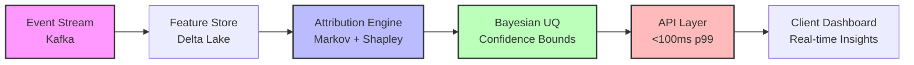

# Michael Forsythe Robinson  
**AI Systems Architect & Marketing Science Engineer**

I build production-grade AI systems that generate measurable revenue and withstand epistemic scrutiny. Not prototypes. Not correlation theater. Real causal inference infrastructure at scale.[page:2]

---

## 2025 Portfolio and Highlights

**View the full 2025 blueprint presentation:**  

  
<b>Quick Stats</b>

- **5+ years** building attribution & ML systems for Fortune 1000 and high-growth startups[page:2]  
- **214K+** qualified leads generated with 99.6% accuracy for geospatial AI systems[page:2]  
- **<100ms** real-time identity resolution at streaming scale (78% accuracy, GDPR/CCPA compliant)[page:2]  
- **30% ROI improvement** via treatment effect heterogeneity in behavioral segmentation[page:2]  
- **70% contact rate** (up from 30%) through attribution-informed outreach optimization[page:2]  

---

## What I Ship

### Attribution Science & Causal Inference

Most “attribution” is just weighted correlation with extra steps. I build systems grounded in **first-principles causal frameworks**:[page:2]

- **Markov chain state modeling** for temporal causality, not last-touch heuristics[page:2]  
- **Shapley value decomposition** for fair marginal contribution using game-theoretic methods[page:2]  
- **Bayesian uncertainty quantification** to separate epistemic from aleatoric error[page:2]  
- **Real-time probabilistic identity resolution** for streaming platforms (Kafka + Ray)[page:2]  

**Why this matters:** It closes the gap between “correlation that shipped” and **causation that scales**.[page:2]

  
<b>System Architecture Example</b>

**Key components:** Kafka for 10K+ events/sec ingest, Delta Lake for versioned features, a Markov+Shapley attribution engine, Bayesian UQ for honest confidence, and a sub-100ms API layer for real-time decisioning.[page:2]

### Production ML Infrastructure

End-to-end data engineering for AI systems that don’t explode in production:[page:2]

- **Event streaming pipelines:** Apache Kafka, Delta Lake, CDC[page:2]  
- **Distributed compute:** Ray, Dask, orchestration with Airflow/Prefect[page:2]  
- **Feature stores & versioning:** MLflow, DVC for reproducible experiments[page:2]  
- **Observability:** Prometheus, Grafana, custom drift detection with statistical tests[page:2]  

**Recent case:** Live event attribution engine for WWE Raw on Netflix, delivering second-screen correlation with <2s latency during live broadcasts.[page:2]

### Marketing Science & Growth Systems

Behavioral profiling, audience segmentation, and revenue optimization:[page:2]

- **Psychographic priors** for context-aware attribution beyond basic demographics[page:2]  
- **Treatment effect heterogeneity** to surface high-value segments (CATE estimation)[page:2]  
- **Multi-armed bandit** optimization for dynamic creative allocation[page:2]  
- **LLM-augmented research** for automated product discovery (2.6 sale-ready products/day, zero manual work)[page:2]  

---

## Case Studies

| System                        | Problem                                                                 | Solution                                                                                          | Outcome                                                                                  |
|-------------------------------|-------------------------------------------------------------------------|---------------------------------------------------------------------------------------------------|------------------------------------------------------------------------------------------|
| Geospatial Lead Gen Engine    | Insurance carrier needed qualified leads in underserved zip codes       | ML on demographic + property data with automated outreach sequencing                              | 214,384 qualified leads at 99.6% accuracy[page:2]                                       |
| Contact Rate Optimizer        | SaaS company stuck at 30% connect rate                                 | Attribution-informed timing and messaging via behavioral clustering                               | Contact rate lifted from 30% → 70%[page:2]                                              |
| Product Research Automation   | E-commerce brand burning 8 hrs/day on manual research                  | LLM-powered competitive analysis, trend detection, and automated scoring                         | 2.6 sale-ready products/day with 100% automation[page:2]                                |
| Streaming Identity Resolution | Ad platform needed cross-device matching under strict privacy regimes   | Probabilistic graph matching with Bayesian priors and low-latency serving                        | 78% accuracy with <100ms p99 latency, fully GDPR/CCPA compliant[page:2]                 |

---

## Core Stack

**Languages & Frameworks**  
Python · TypeScript · SQL · Next.js[page:2]

**Data & ML Infrastructure**  
Apache Kafka · PostgreSQL · Delta Lake · Ray[page:2]

**Specialized**  
Bayesian statistics · Causal inference (DoWhy, EconML) · LLMs (Claude, GPT-4) · Make.com · Shapley values · Markov chains[page:2]

---

## Selected Projects

Pinned repositories showcase production-grade systems:[page:2]

- `first-principles-attribution` – Causal framework resolving correlation vs. causation with Markov/Shapley/Bayesian UQ[page:2]  
- `probabilistic-identity-resolution` – Real-time streaming identity graph for multi-device attribution[page:2]  
- `behavioral-profiling-attribution` – Context-aware attribution with psychographic priors (30% ROI lift)[page:2]  
- `live-event-attribution-wwe-raw` – Second-screen correlation engine for sports advertising[page:2]  
- `portfolio-hub` – Next.js command center for 10+ production attribution systems[page:2]  

---

## Currently Building

- **Multi-touch attribution whitepaper (v2.0):** Formalizing the epistemic gap in correlation-based attribution models[page:2]  
- **Streaming feature store:** Real-time feature computation for sub-100ms inference pipelines[page:2]  
- **Open-source attribution library:** First-principles toolkit for marketing science teams[page:2]  

---

## The 2025 Blueprint

### Core Philosophy: Modern Polymath

The output of 2025 came from a deliberate operating system: merge deep technical rigor, aggressive creativity, and commercialization into one continuous stack.[page:2] That stack shipped production SaaS, published fiction, and scalable marketing engines instead of isolated side projects.[page:2]

### Principle I: Symbiosis of Art and Algorithm

Creative work like *mentally ill but hot* and the Aethoria universe sharpened empathy, narrative, and non-linear thinking that feed directly into system design.[page:2] In return, technical systems—966+ art pieces, interactive tools, and AI consoles—became canvases where algorithms and aesthetics are fused on purpose.[page:2]

### Principle II: AI as the Universal Amplifier

An **AI-first** approach runs through everything: the “500 AI Agents Platform” (52 agents powering 11 SaaS products) and fluency across 15+ AI platforms show applied 10x leverage.[page:2] AI functions as a collaborator here, collapsing iteration cycles and unlocking scope unreachable by a solo human.[page:2]

### Principle III: Full-Stack Completeness

The bar is “from idea to production,” not “interesting demo.”[page:2] That showed up in the LitRPG Unlimited TypeScript + Stripe overhaul, 11 live SaaS products, and a published novel—all built as finished, monetizable assets.[page:2]

### Principle IV: Data Sovereignty

Owning and interrogating 25+ GB of personal exhaust from Google, Facebook, and more turned passive data into an Attribution Mind Map of real behavior.[page:2] The same philosophy underpins how user-centric, ethical products are designed going forward.[page:2]

### Principle V: Ethical Engineering

Projects like Lightwell JAMI-3, an AI therapy system grounded in clinical psychology and guardrails, encode ethics as a core requirement, not a marketing slide.[page:2] Sensitive AI domains are treated with stricter standards and explicit safeguards.[page:2]

---

## Evidence From the Forge

### Engineered Intelligence

You built and deployed systems like the 11-product SaaS ecosystem, the 214,384-lead DFW Roofing Intelligence engine, and JARVIS, a local, persistent personal AI layer.[page:2] The Attribution Mind Map pushed into research-grade behavioral profiling over 11 years of temporal data.[page:2]

### Weaving Worlds

In parallel, you shipped *Aethoria: Convergence* to Kindle, finished *mentally ill but hot*, created 966+ art pieces, and automated a print-on-demand Shopify store end-to-end.[page:2] The Aethoria Console turned that IP into an AI-powered, interactive RPG experience.[page:2]

### Building Ecosystems

On the commercial side, Forsythe Publishing & Marketing targets local dominance with AI-driven lead follow-up, while LitRPG Unlimited demonstrates full-stack product ownership from codebase to payments.[page:2] Together, these ecosystems turn creative and technical assets into durable revenue engines.[page:2]

---

## The Mission: Scale the Impact

If 2025 was about building the foundation, 2026 is about scaling the impact.[page:2] The goal now is to move from creation to deployment—launch products, publish books, generate revenue, and build a lasting legacy at the intersection of AI, psychology, and creative expression.[page:2]

> All systems are operational. That’s when we scale to the moon.[page:2]

---

---

## Let’s Connect

**Open to:**  
Consulting engagements (attribution systems, ML infrastructure, data science strategy) · Speaking & workshops (marketing science, causal inference, production ML) · Advising high-growth startups on data/AI architecture[page:2]

**Reach me:**  
[LinkedIn](https://www.linkedin.com/in/michael-forsythe-082255391/) · [Portfolio](https://portfolio-hub-kappa-murex.vercel.app/) · Email: `Forsythepublishing@gmail.com`[page:2]

---

## GitHub Activity

---

## Achievements & Recognition

- **Make Foundation Certified** — Advanced automation & integration specialist[page:2]  
- **Open-source contributor** — First-principles attribution framework (Markov + Shapley + Bayesian UQ)[page:2]  
- **Fortune 1000 experience** — Built secure systems for a $5.4B market cap finance department[page:2]  
- **0→1 builder** — Scaled an online community from 0 to 1,200 active members in 4 months[page:2]  

---
